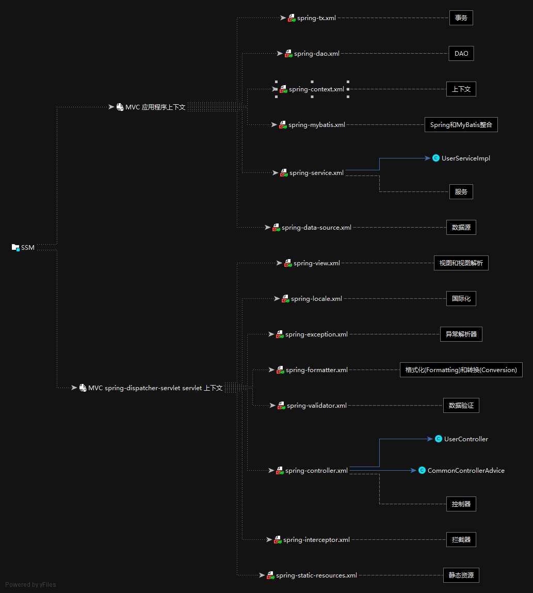

<h1 align="center">Spring SpringMVC MyBatis</h1>


[TOC]


# 一. 概述  


## 1. Spring  


## 2. SpringMVC  

### MVC  

- Model（模型）
  - 数据模型，提供要展示的数据，：Value Object（数据Dao） 和 服务层（行为Service），提供数据和业务。

- View（视图）
  - 负责进行模型的展示，即用户界面

- Controller（控制器）
  - 调度员，接收用户请求，委托给模型进行处理（状态改变），处理完毕后把返回的模型数据返回给视图，由视图负责展示。

### SpringMVC的特点  

- Spring为展现层提供的基于MVC设计理念的Web框架

- SpirngMVC通过一套MVC注解，让POJO成为处理请求的控制器，而无须实现任何接口

- 支持REST风格的URL请求

- 采用了松散耦合可拔插组件结构，扩展性和灵活性


## 3. MyBatis  


## 4. [spring的包大概作用](https://www.cnblogs.com/of-course/p/6390767.html)  

1. spring.jar
   - 是包含有完整发布模块的单个jar 包。

2. org.springframework.aop
   - 包含在应用中使用Spring的AOP特性时所需的类。

3. org.springframework.asm
   - Spring独立的asm程序, Spring2.5.6的时候需要asmJar 包, 3.0开始提供他自己独立的asmJar。

4. rg.springframework.aspects
   - 提供对AspectJ的支持，以便可以方便的将面向方面的功能集成进IDE中， 比如Eclipse AJDT。

5. org.springframework.beans
   - 所有应用都要用到的，它包含访问配置文件、创建和管理bean 以及进行Inversion of Control / Dependency Injection（IoC/DI）操作相关的所有类。

6. org.springframework.context.support
   - 包含支持缓存Cache（ehcache）、JCA、JMX、 邮件服务（Java Mail、COS Mail）、任务计划Scheduling（Timer、Quartz）方面的类。

7. org.springframework.context
   - 为Spring核心提供了大量扩展。可以找到使用Spring ApplicationContext 特性时所需的全部类，JDNI所需的全部类，UI方面的用来与模板（Templating）引擎如 Velocity、FreeMarker、 JasperReports集成的类，以及校验Validation方面的相关类。

8. org.springframework.core
   - 包含Spring框架基本的核心工具类，Spring其它组件要都要使用到这个包里的类， 是其它组件的基本核心。

9. org.springframework.expression
   - Spring表达式语言。

10. org.springframework.instrument.tomcat
    - Spring3.0对Tomcat的连接池的集成。

11. org.springframework.instrument
    - Spring3.0对服务器的代理接口。

12. org.springframework.jdbc
    - 包含对Spring对JDBC数据访问进行封装的所有类。

13. org.springframework.jms
    - 提供了对JMS 1.0.2/1.1的支持类。http://baike.baidu.com/link?url=HfioUoiPUtvgtXEECsRhPJ2Ek2oWQwZgWObWUMF36PQHJ2CFiJ2nb-hxGcfj4kFumjr6-0J9FAnHOkVrbkubYq

14. org.springframework.orm
    - 包含Spring对DAO特性集进行了扩展，使其支持 iBATIS、JDO、OJB、TopLink， 因为Hibernate已经独立成包了，现在不包含在这个包里了。这个jar文件里大部分的类都要依赖spring-dao.jar 里的类，用这个包时你需要同时包含spring-dao.jar包。

15. org.springframework.oxm
    - Spring 对Object/XMl的映射支持,可以让Java与XML之间来回切换。

16. org.springframework.test
    - 对Junit等测试框架的简单封装。

17. org.springframework.transaction
    - 为JDBC、Hibernate、JDO、JPA等提供的一致的声明式和编程式事务管理。

18. org.springframework.web.portlet
    - SpringMVC的增强。

19. org.springframework.web.servlet
    - 对J2EE6.0 的Servlet3.0的支持。

20. org.springframework.web.struts
    - Struts框架支持，可以更方便更容易的集成Struts框架。

21. org.springframework.web
    - 包含Web应用开发时，用到Spring框架时所需的核心类，包括自动载入 WebApplicationContext特性的类、Struts与JSF集成类、文件上传的支持类、Filter类和大量工具辅助类

22. Spring webmvc：
    - 包含SpringMVC框架相关的所有类。包含国际化、标签、Theme、视图展现的FreeMarker、JasperReports、Tiles、Velocity、XSLT相关类。当然，如果你的应用使用了独立的MVC框架，则无需这个JAR文件里的任何类。
       23.Spring webmvc portlet：Spring MVC的增强

24. spring-tx.3.2.2.jar
    - spring提供对事务的支持，事务的相关处理以及实现类就在这个Jar包中


# 二. 导入依赖  


```xml
	<properties>
        <project.build.sourceEncoding>UTF-8</project.build.sourceEncoding>
        <maven.compiler.source>1.7</maven.compiler.source>
        <maven.compiler.target>1.7</maven.compiler.target>

        <!-- 集中定义依赖版本号 -->
        <project.build.sourceEncoding>UTF-8</project.build.sourceEncoding>
        <maven.compiler.source>1.8</maven.compiler.source>
        <maven.compiler.target>1.8</maven.compiler.target>

        <junit.version>4.12</junit.version>
        <spring.version>5.2.3.RELEASE</spring.version>
        <pagehelper.version>4.0.0</pagehelper.version>
        <servlet-api.version>2.5</servlet-api.version>
        <mybatis.version>3.5.7</mybatis.version>
        <mybatis.spring.version>2.0.6</mybatis.spring.version>
        <mybatis.paginator.version>1.2.17</mybatis.paginator.version>
        <mysql.version>8.0.11</mysql.version>
        <druid.version>1.0.15</druid.version>
        <jackson.version.core>2.9.5</jackson.version.core>

        <logback.version>1.1.3</logback.version>

    </properties>

    <dependencies>
        <!-- region Spring -->

        <!-- region Spring 核心 -->
        <!--
             1. spring-context
             2. spring-core
             3. spring-beans
             4. spring-expression
         -->
        <dependency>
            <groupId>org.springframework</groupId>
            <artifactId>spring-context</artifactId>
            <version>${spring.version}</version>
        </dependency>
        <!-- endregion Spring 核心 -->

        <!-- region     aop 核心 -->
        <!--
            1. spring-aspects
        -->
        <dependency>
            <groupId>org.springframework</groupId>
            <artifactId>spring-aspects</artifactId>
            <version>${spring.version}</version>
        </dependency>
        <!-- endregion   aop -->

        <!-- region     ioc 核心 -->


        <!-- endregion  ioc -->


        <!-- region     jdbc 核心 -->
        <!--
            1. spring-jdbc
        -->
        <dependency>
            <groupId>org.springframework</groupId>
            <artifactId>spring-jdbc</artifactId>
            <version>${spring.version}</version>
        </dependency>
        <!-- endregion  jdbc -->

        <!-- region     spring 测试 -->
        <!--
            1. spring-test
        -->
        <dependency>
            <groupId>org.springframework</groupId>
            <artifactId>spring-test</artifactId>
            <version>${spring.version}</version>
        </dependency>
        <!-- endregion  spring 测试 -->

        <!-- endregion -->


        <!--
            提供了对JMS 1.0.2/1.1的支持类。
            http://baike.baidu.com/link?url=HfioUoiPUtvgtXEECsRhPJ2Ek2oWQwZgWObWUMF36PQHJ2CFiJ2nb-hxGcfj4kFumjr6-0J9FAnHOkVrbkubYq
        -->
        <dependency>
            <groupId>org.springframework</groupId>
            <artifactId>spring-jms</artifactId>
            <version>${spring.version}</version>
        </dependency>

        <!--
            包含支持
                1. 缓存Cache（ehcache）
                2. JCA
                3. JMX
                4. 邮件服务（Java Mail、COS Mail）
                5. 任务计划Scheduling（Timer、Quartz）
            方面的类
        -->
        <dependency>
            <groupId>org.springframework</groupId>
            <artifactId>spring-context-support</artifactId>
            <version>${spring.version}</version>
        </dependency>


        <!-- region SpringMVC -->

        <!-- region     SpringMVC 核心 -->
        <!--
            1. spring-web
            2. spring-webmvc
        -->
        <dependency>
            <groupId>org.springframework</groupId>
            <artifactId>spring-webmvc</artifactId>
            <version>${spring.version}</version>
        </dependency>
        <!-- endregion  SpringMVC 核心 -->

        <!-- region    jackson json转pojo-->
        <!--
            1. jackson-core
            2. jackson-annotations
            3. jackson-databind
        -->
        <dependency>
            <groupId>com.fasterxml.jackson.core</groupId>
            <artifactId>jackson-core</artifactId>
            <version>${jackson.version.core}</version>
        </dependency>
        <dependency>
            <groupId>com.fasterxml.jackson.core</groupId>
            <artifactId>jackson-annotations</artifactId>
            <version>${jackson.version.core}</version>
        </dependency>
        <dependency>
            <groupId>com.fasterxml.jackson.core</groupId>
            <artifactId>jackson-databind</artifactId>
            <version>${jackson.version.core}</version>
        </dependency>
        <!-- endregion  jackson -->

        <!-- region     数据校验 -->
        <!--
            1. classmate-1.3.1.jar
            2. hibernate-validator-6.0.5.Final.jar
            3. jboss-logging-3.3.0.Final.jar
            4. validation-api-2.0.0.Final.jar
        -->
        <dependency>
            <groupId>org.hibernate</groupId>
            <artifactId>hibernate-validator</artifactId>
            <version>5.3.6.Final</version>
        </dependency>
        <!-- endregion  数据校验 -->


        <!-- region     Excel 视图的使用 -->
        <dependency>
            <groupId>org.apache.poi</groupId>
            <artifactId>poi-ooxml</artifactId>
            <version>3.16</version>
        </dependency>
        <!-- endregion  Excel 视图的使用-->

        <!-- region jstl 生成 JstlView -->
        <!--
            1. jstl
            2. standard
        -->
        <dependency>
            <groupId>jstl</groupId>
            <artifactId>jstl</artifactId>
            <version>1.2</version>
        </dependency>
        <dependency>
            <groupId>taglibs</groupId>
            <artifactId>standard</artifactId>
            <version>1.1.2</version>
        </dependency>
        <!--
        上面和下面的包路径一致[可能]是做的兼容包
        <dependency>
            <groupId>javax.servlet.jsp.jstl</groupId>
            <artifactId>jstl-api</artifactId>
            <version>1.2</version>
            <exclusions>
                <exclusion>
                    <groupId>javax.servlet</groupId>
                    <artifactId>servlet-api</artifactId>
                </exclusion>
                <exclusion>
                    <groupId>javax.servlet.jsp</groupId>
                    <artifactId>jsp-api</artifactId>
                </exclusion>
            </exclusions>
        </dependency>

        <dependency>
            <groupId>org.glassfish.web</groupId>
            <artifactId>jstl-impl</artifactId>
            <version>1.2</version>
            <exclusions>
                <exclusion>
                    <groupId>javax.servlet</groupId>
                    <artifactId>servlet-api</artifactId>
                </exclusion>
                <exclusion>
                    <groupId>javax.servlet.jsp</groupId>
                    <artifactId>jsp-api</artifactId>
                </exclusion>
                <exclusion>
                    <groupId>javax.servlet.jsp.jstl</groupId>
                    <artifactId>jstl-api</artifactId>
                </exclusion>
            </exclusions>
        </dependency>
        -->
        <!-- endregion -->

        <!-- region     验证码 -->
        <!--
            1. kaptcha
        -->
        <dependency>
            <groupId>com.github.penggle</groupId>
            <artifactId>kaptcha</artifactId>
            <version>2.3.2</version>
        </dependency>
        <!-- endregion  验证码 -->

        <!-- region     文件上传/下载 -->
        <!--        <dependency>-->
        <!--            <groupId>commons-fileupload</groupId>-->
        <!--            <artifactId>commons-fileupload</artifactId>-->
        <!--            <version>1.3.1</version>-->
        <!--        </dependency>-->
        <!-- endregion  文件上传/下载-->


        <!-- endregion SpringMVC -->

        <!-- region MyBatis -->

        <!-- region     MyBatis 核心 -->
        <dependency>
            <groupId>org.mybatis</groupId>
            <artifactId>mybatis</artifactId>
            <version>${mybatis.version}</version>
        </dependency>
        <!-- endregion -->

        <!-- region     类型处理程序(LocalDateTime) -->
        <dependency>
            <groupId>org.mybatis</groupId>
            <artifactId>mybatis-typehandlers-jsr310</artifactId>
            <version>1.0.2</version>
        </dependency>
        <!-- endregion  类型处理程序 -->

        <!-- region     Spring MyBatis 整合 -->
        <dependency>
            <groupId>org.mybatis</groupId>
            <artifactId>mybatis-spring</artifactId>
            <version>${mybatis.spring.version}</version>
        </dependency>
        <!-- endregion  Spring MyBatis 整合-->

        <!-- region     分页插件 -->
        <dependency>
            <groupId>com.github.miemiedev</groupId>
            <artifactId>mybatis-paginator</artifactId>
            <version>${mybatis.paginator.version}</version>
        </dependency>
        <!-- endregion  分页插件 -->

        <!-- region     逆向工程 -->
        <dependency>
            <groupId>org.mybatis.generator</groupId>
            <artifactId>mybatis-generator-core</artifactId>
            <version>1.4.0</version>
        </dependency>
        <!-- endregion  逆向工程 -->

        <!-- region     ehcache 整合 -->
        <!--
            1. mybatis-ehcache
            2. ehcache-core
        -->
        <dependency>
            <groupId>org.mybatis.caches</groupId>
            <artifactId>mybatis-ehcache</artifactId>
            <version>1.2.1</version>
        </dependency>
        <!-- endregion  ehcache 整合 -->

        <!-- endregion -->

        <!-- region 其它 -->

        <!-- region 数据源驱动 -->
        <!-- MySql -->
        <dependency>
            <groupId>mysql</groupId>
            <artifactId>mysql-connector-java</artifactId>
            <version>${mysql.version}</version>
        </dependency>
        <!-- endregion 数据源驱动 -->

        <!-- region     连接池 -->
        <dependency>
            <groupId>com.alibaba</groupId>
            <artifactId>druid</artifactId>
            <version>${druid.version}</version>
        </dependency>
        <!-- endregion  连接池 -->

        <!-- region logback日志配置开始 -->
        <dependency>
            <groupId>ch.qos.logback</groupId>
            <artifactId>logback-core</artifactId>
            <version>${logback.version}</version>
        </dependency>
        <dependency>
            <groupId>ch.qos.logback</groupId>
            <artifactId>logback-access</artifactId>
            <version>${logback.version}</version>
        </dependency>
        <dependency>
            <groupId>ch.qos.logback</groupId>
            <artifactId>logback-classic</artifactId>
            <version>${logback.version}</version>
        </dependency>
        <!-- region     Spring Logback 整合 -->
        <dependency>
            <groupId>org.logback-extensions</groupId>
            <artifactId>logback-ext-spring</artifactId>
            <version>0.1.2</version>
        </dependency>
        <dependency>
            <groupId>org.slf4j</groupId>
            <artifactId>log4j-over-slf4j</artifactId>
            <version>1.7.12</version>
        </dependency>
        <dependency>
            <groupId>org.slf4j</groupId>
            <artifactId>jcl-over-slf4j</artifactId>
            <version>1.7.12</version>
        </dependency>
        <!-- endregion  Spring Logback 整合-->

        <!-- endregion logback日志配置结束 -->

        <!-- region     测试框架-->
        <dependency>
            <groupId>junit</groupId>
            <artifactId>junit</artifactId>
            <version>4.11</version>
            <scope>test</scope>
        </dependency>
        <!-- endregion  测试框架 -->
        <!-- endregion -->
    </dependencies>
```


# 三. 配置  


## 1. Tomcat  


### 1. web.xml  


```xml
<?xml version="1.0" encoding="UTF-8"?>

<web-app xmlns:xsi="http://www.w3.org/2001/XMLSchema-instance"
         xmlns="http://java.sun.com/xml/ns/javaee"
         xsi:schemaLocation="http://java.sun.com/xml/ns/javaee http://java.sun.com/xml/ns/javaee/web-app_3_0.xsd"
         id="WebApp_ID" version="3.0" >
    <display-name>Archetype Created Web Application</display-name>

    <!-- region 解决中文乱码(只对POST有效) -->
    <filter>
        <filter-name>CharacterEncodingFilter</filter-name>
        <filter-class>org.springframework.web.filter.CharacterEncodingFilter</filter-class>
        <init-param>
            <param-name>encoding</param-name>
            <param-value>UTF-8</param-value>
        </init-param>
    </filter>
    <filter-mapping>
        <filter-name>CharacterEncodingFilter</filter-name>
        <url-pattern>/*</url-pattern>
    </filter-mapping>
    <!-- endregion -->

    <!-- region 监听器 -->
    <listener>
        <!-- logback 监听 必须在 spring 前 -->
        <listener-class>ch.qos.logback.ext.spring.web.LogbackConfigListener</listener-class>
    </listener>
    <listener>
        <!--
        两个 spring 容器
        2021-06-13 01:50:02.014 [RMI TCP Connection(3)-127.0.0.1] INFO  org.springframework.web.context.ContextLoader: 根 WebApplicationContext：初始化开始
        2021-06-13 01:50:02.160 [RMI TCP Connection(3)-127.0.0.1] DEBUG o.s.beans.factory.xml.XmlBeanDefinitionReader:
        从类路径资源加载了 0 个 bean 定义 [spring/applicationContext.xml]

        2021-06-13 01:50:02.234 [RMI TCP Connection(3)-127.0.0.1] INFO  org.springframework.web.servlet.DispatcherServlet: 初始化 Servlet 'spring-dispatcher'
        [D:\Tomcat\apache-tomcat-7.0.107\webapps\SpringAndSpringMVCAndMyBatis_war\WEB-INF\classes\com\crtf\ssm\controller\advice\CommonControllerAdvice.class]
        2021-06-13 01:50:02.407 [RMI TCP Connection(3)-127.0.0.1] DEBUG o.s.beans.factory.xml.XmlBeanDefinitionReader:
        从文件加载 36 个 bean 定义 [D:\Tomcat\apache-tomcat-7.0.107\webapps\SpringAndSpringMVCAndMyBatis_war\WEB-INF\classes\spring\spring-mvc\spring-web.xml]
        -->
        <!-- 上下文加载器侦听器 -->
        <listener-class>org.springframework.web.context.ContextLoaderListener</listener-class>
    </listener>
    <listener>
        <!-- 请求上下文监听器 -->
        <listener-class>org.springframework.web.context.request.RequestContextListener</listener-class>
    </listener>
    <!-- endregion -->

    <!-- region 上下文参数 -->
    <context-param>
        <!-- spring 父容器 -->
        <param-name>contextConfigLocation</param-name>
        <param-value>classpath:/spring/applicationContext/spring-*.xml</param-value>
    </context-param>
    <context-param>
        <!-- logback -->
        <param-name>logbackConfigLocation</param-name>
        <param-value>classpath:/logback/logback.xml</param-value>
    </context-param>
    <!-- endregion -->

    <!-- region 调度服务程序 -->
    <servlet>
        <servlet-name>spring-dispatcher-servlet</servlet-name>
        <servlet-class>org.springframework.web.servlet.DispatcherServlet</servlet-class>
        <init-param>
            <!-- spring 子容器 -->
            <param-name>contextConfigLocation</param-name>
            <param-value>classpath:/spring/mvc/spring-*.xml</param-value>
        </init-param>
        <load-on-startup>1</load-on-startup>
        <multipart-config>
            <!-- 上传到的路径 -->
            <location>D:\Learn\Study\Java\SpringAndSpringMVCAndMyBatis\SpringAndSpringMVCAndMyBatis\uploads</location>
            <max-file-size>5242880</max-file-size>
            <max-request-size>10485760</max-request-size>
            <file-size-threshold>0</file-size-threshold>
        </multipart-config>
    </servlet>
    <servlet-mapping>
        <servlet-name>spring-dispatcher-servlet</servlet-name>
        <url-pattern>/</url-pattern>
    </servlet-mapping>
    <!-- endregion 调度服务程序-->

    <!-- region 请求方式转换 DELETE PUT 过虑器 -->
    <filter>
        <filter-name>HiddenHttpMethodFilter</filter-name>
        <filter-class>org.springframework.web.filter.HiddenHttpMethodFilter</filter-class>
    </filter>
    <filter-mapping>
        <filter-name>HiddenHttpMethodFilter</filter-name>
        <url-pattern>/*</url-pattern>
    </filter-mapping>
    <!-- endregion-->

    <error-page>
        <error-code>404</error-code>
        <location>/WEB-INF/view/error/404.jsp</location>
    </error-page>

</web-app>
```


## 2. Spring  




### A. 应用程序上下文  

#### 1. spring-tx.xml    事务  

```xml
 <?xml version="1.0" encoding="UTF-8"?>
<beans xmlns="http://www.springframework.org/schema/beans"
       xmlns:xsi="http://www.w3.org/2001/XMLSchema-instance" xmlns:tx="http://www.springframework.org/schema/tx"
       xmlns:context="http://www.springframework.org/schema/context"
       xsi:schemaLocation="http://www.springframework.org/schema/beans http://www.springframework.org/schema/beans/spring-beans.xsd http://www.springframework.org/schema/tx http://www.springframework.org/schema/tx/spring-tx.xsd http://www.springframework.org/schema/context https://www.springframework.org/schema/context/spring-context.xsd">

    <!-- 事务 -->

    <!-- 事务管理 -->
    <bean id="transactionManager"
          class="org.springframework.jdbc.datasource.DataSourceTransactionManager">
        <property name="dataSource" ref="dataSource" />
    </bean>

    <!-- 开启声明式事物 标注@Transactional的类和方法将具有事务性 -->
    <tx:annotation-driven transaction-manager="transactionManager"/>

</beans>
```


#### 2. spring-dao.xml    DAO  


```xml
<?xml version="1.0" encoding="UTF-8"?>
<beans xmlns="http://www.springframework.org/schema/beans"
       xmlns:xsi="http://www.w3.org/2001/XMLSchema-instance"
       xmlns:context="http://www.springframework.org/schema/context" xmlns:tx="http://www.springframework.org/schema/tx"
       xsi:schemaLocation="http://www.springframework.org/schema/beans http://www.springframework.org/schema/beans/spring-beans.xsd http://www.springframework.org/schema/context https://www.springframework.org/schema/context/spring-context.xsd http://www.springframework.org/schema/tx http://www.springframework.org/schema/tx/spring-tx.xsd">

    <!-- DAO -->

    <!-- 4、DAO接口所在包名，Spring会自动查找其下的类(使用mybatis) -->
    <bean class="org.mybatis.spring.mapper.MapperScannerConfigurer">
        <property name="basePackage" value="com.crtf.ssm.core.dao"/>
        <property name="sqlSessionFactoryBeanName" value="sqlSessionFactory"/>
    </bean>

</beans>
```


#### 3. spring-context.xml    上下文

```xml
<?xml version="1.0" encoding="UTF-8"?>
<beans xmlns="http://www.springframework.org/schema/beans"
       xmlns:xsi="http://www.w3.org/2001/XMLSchema-instance"
       xmlns:context="http://www.springframework.org/schema/context"
       xsi:schemaLocation="http://www.springframework.org/schema/beans http://www.springframework.org/schema/beans/spring-beans.xsd http://www.springframework.org/schema/context https://www.springframework.org/schema/context/spring-context.xsd">

    <!-- 上下文 -->

<!--    <context:component-scan base-package="com.crtf.ssm" >-->
<!--        <context:exclude-filter type="annotation" expression="org.springframework.stereotype.Controller"/>-->
<!--        <context:exclude-filter type="annotation" expression="org.springframework.web.bind.annotation.ControllerAdvice"/>-->
<!--    </context:component-scan>-->

</beans>
```

#### 4. spring-mybatis.xml    Spring和MyBatis整合  

```xml
<?xml version="1.0" encoding="UTF-8"?>
<beans xmlns="http://www.springframework.org/schema/beans"
       xmlns:xsi="http://www.w3.org/2001/XMLSchema-instance"
       xsi:schemaLocation="http://www.springframework.org/schema/beans http://www.springframework.org/schema/beans/spring-beans.xsd">

    <!-- 配置整合mybatis过程 -->

    <!-- 3、配置mybatis的sqlSessionFactory -->
    <bean id="sqlSessionFactory" class="org.mybatis.spring.SqlSessionFactoryBean">
        <property name="dataSource" ref="dataSource"/>
        <!-- 自动扫描mappers.xml文件 -->
        <property name="mapperLocations" value="classpath:mapper/*Mapper.xml"/>
        <!-- 扫描mybatis-config文件 -->
        <property name="configLocation" value="classpath:mybatis/mybatis-config.xml"/>
        <!-- 扫描entity包，使用别名,或者在mybatis-config中配置,二选一 -->
        <property name="typeAliasesPackage" value="com.crtf.ssm.core.model"/>
    </bean>

    <!--    <bean class="org.mybatis.spring.mapper.MapperFactoryBean">-->
    <!--        <property name="sqlSessionFactory" ref="sqlSessionFactory"/>-->
    <!--        <property name="mapperInterface" value="com.crtf.ssm.dao.UserMapper"/>-->
    <!--    </bean>-->

</beans>
```

#### 5. spring-service.xml    服务  

```xml
<?xml version="1.0" encoding="UTF-8"?>
<beans xmlns="http://www.springframework.org/schema/beans"
       xmlns:xsi="http://www.w3.org/2001/XMLSchema-instance"
       xmlns:context="http://www.springframework.org/schema/context" xmlns:tx="http://www.springframework.org/schema/tx"
       xsi:schemaLocation="http://www.springframework.org/schema/beans http://www.springframework.org/schema/beans/spring-beans.xsd http://www.springframework.org/schema/context https://www.springframework.org/schema/context/spring-context.xsd http://www.springframework.org/schema/tx http://www.springframework.org/schema/tx/spring-tx.xsd">

    <!-- 服务 -->

    <!-- 扫描service包下所有使用注解的类型 -->
    <context:component-scan base-package="com.crtf.ssm.core.service" use-default-filters="false">
        <context:include-filter type="annotation" expression="org.springframework.stereotype.Service"/>
    </context:component-scan>

</beans>
```

#### 6. spring-data-source.xml    数据源  

```xml
<?xml version="1.0" encoding="UTF-8"?>
<beans xmlns="http://www.springframework.org/schema/beans"
       xmlns:xsi="http://www.w3.org/2001/XMLSchema-instance"
       xmlns:context="http://www.springframework.org/schema/context"
       xsi:schemaLocation="http://www.springframework.org/schema/beans http://www.springframework.org/schema/beans/spring-beans.xsd http://www.springframework.org/schema/context https://www.springframework.org/schema/context/spring-context.xsd">

    <!-- 数据源 -->

    <!-- 1. 配置数据库相关参数properties的属性：${url} -->
    <context:property-placeholder location="classpath:db/config.properties"/>

    <!-- 2、配置数据库连接池 -->
    <bean id="dataSource" class="org.springframework.jdbc.datasource.DriverManagerDataSource">
        <property name="driverClassName" value="${jdbc.driver}"/>
        <property name="url" value="${jdbc.url}"/>
        <property name="username" value="${jdbc.username}"/>
        <property name="password" value="${jdbc.password}"/>
    </bean>

</beans>
```


### B. 调度服务上下文  


#### 1. spring-view.xml    视图和视图解析器  

```xml
<?xml version="1.0" encoding="UTF-8"?>
<beans xmlns="http://www.springframework.org/schema/beans"
       xmlns:xsi="http://www.w3.org/2001/XMLSchema-instance" xmlns:mvc="http://www.springframework.org/schema/mvc"
       xsi:schemaLocation="http://www.springframework.org/schema/beans http://www.springframework.org/schema/beans/spring-beans.xsd http://www.springframework.org/schema/mvc https://www.springframework.org/schema/mvc/spring-mvc.xsd">

    <!-- 视图 视图解析器 -->

    <!-- region 视图解析器 -->
    <bean id="viewResolver" class="org.springframework.web.servlet.view.InternalResourceViewResolver">
        <!-- JstlView -->
        <property name="viewClass" value="org.springframework.web.servlet.view.JstlView"/>
        <property name="prefix" value="/WEB-INF/view/"/>
        <property name="suffix" value=".jsp"/>
    </bean>

    <!-- 不用走Controller方法但经过springMVC -->
    <mvc:view-controller path="/user/home" view-name="home"/>
    <mvc:view-controller path="/user/toSignUp" view-name="sign_up"/>
    <!-- 测试 自定义 视图解析器 -->
    <mvc:view-controller path="/toMyView" view-name="crtf:crtf"/>
    <!-- endregion-->

    <!-- 自定义视图 -->
    <bean class="com.crtf.ssm.core.viewresolver.MyViewResolver">
        <property name="order" value="1"/>
    </bean>

</beans>
```


#### 2. spring-locale.xml    国际化  

```xml
<?xml version="1.0" encoding="UTF-8"?>
<beans xmlns="http://www.springframework.org/schema/beans"
       xmlns:xsi="http://www.w3.org/2001/XMLSchema-instance"
       xsi:schemaLocation="http://www.springframework.org/schema/beans http://www.springframework.org/schema/beans/spring-beans.xsd">

    <!-- 国际化 -->

    <!-- 校验错误信息配置文件 -->
    <bean id="messageSource" class="org.springframework.context.support.ReloadableResourceBundleMessageSource">
        <!-- 默认编码 -->
        <property name="defaultEncoding" value="UTF-8"/>
        <property name="basenames">
            <array>
                <!-- 全局语言
                        <<坑>>路径必须为:
                        前缀  classpath:
                        路径  /language/user/home     这里的路径第一个 / 是为了IDEA不报错
                -->
                <value>WEB-INF/language/user/home</value>
                <!-- 数据验证错误提示语言 -->
                <value>WEB-INF/language/error/error</value>
            </array>
        </property>
        <!-- 找不到messageKey的话，也不抛出NoSuchMessageException -->
        <property name="useCodeAsDefaultMessage" value="true"/>
        <!-- 资源文件编码格式 -->
        <property name="fileEncodings" value="UTF-8"/>
        <!-- 对资源文件内容缓存时间，单位秒 -->
        <property name="cacheSeconds" value="3600"/>
    </bean>
    <!-- 校验错误信息配置文件 -->
    <!--            <bean id="messageSource" class="org.springframework.context.support.ResourceBundleMessageSource">-->
    <!--                <property name="defaultEncoding" value="UTF-8"/>-->
    <!--                <property name="basenames" >-->
    <!--                    <array>-->
    <!--                        &lt;!&ndash; 全局语言 &ndash;&gt;-->
    <!--                        <value>language.user.home</value>-->
    <!--                        &lt;!&ndash; 数据验证错误提示语言 &ndash;&gt;-->
    <!--                        <value>language.error.error</value>-->
    <!--                    </array>-->
    <!--                </property>-->
    <!--                &lt;!&ndash; 对资源文件内容缓存时间，单位秒 &ndash;&gt;-->
    <!--                <property name="cacheSeconds" value="120" />-->
    <!--            </bean>-->
    <!--   <bean id="localeResolver" class="org.springframework.web.servlet.i18n.CookieLocaleResolver">-->
    <!--       <property name="cookieName" value="lang"/>-->
    <!--       <property name="cookieMaxAge" value="20"/>-->
    <!--       <property name="defaultLocale" value="zh_CN"/>-->
    <!--   </bean>-->
    <bean id="localeResolver" class="org.springframework.web.servlet.i18n.SessionLocaleResolver">
        <property name="defaultLocale" value="zh_CN"/>
    </bean>
    <!-- 自定义区域解析器 -->
    <!--        <bean id="localeResolver" class="com.crtf.ssm.util.language.CustomLocaleResolver"/>-->

</beans>
```


#### 3. spring-exception.xml    异常解析器  

```xml
<?xml version="1.0" encoding="UTF-8"?>
<beans xmlns="http://www.springframework.org/schema/beans"
       xmlns:xsi="http://www.w3.org/2001/XMLSchema-instance"
       xsi:schemaLocation="http://www.springframework.org/schema/beans http://www.springframework.org/schema/beans/spring-beans.xsd">

    <!-- 异常解析器 -->

    <!-- 简单映射异常解析器 -->
    <bean class="org.springframework.web.servlet.handler.SimpleMappingExceptionResolver">
        <property name="exceptionMappings">
            <props>
                <prop key="java.lang.NullPointerException">error/null_pointer_exception</prop>
            </props>
        </property>
        <!-- 异常属性的默认名称："exception" -->
        <property name="exceptionAttribute" value="exception"/>
    </bean>
</beans>
```


#### 4. spring-formatter.xml    格式化和转换  

```xml
<?xml version="1.0" encoding="UTF-8"?>
<beans xmlns="http://www.springframework.org/schema/beans"
       xmlns:xsi="http://www.w3.org/2001/XMLSchema-instance" xmlns:mvc="http://www.springframework.org/schema/mvc"
       xmlns:context="http://www.springframework.org/schema/context"
       xmlns:util="http://www.springframework.org/schema/util"
       xsi:schemaLocation="http://www.springframework.org/schema/beans http://www.springframework.org/schema/beans/spring-beans.xsd http://www.springframework.org/schema/mvc https://www.springframework.org/schema/mvc/spring-mvc.xsd http://www.springframework.org/schema/context https://www.springframework.org/schema/context/spring-context.xsd http://www.springframework.org/schema/util https://www.springframework.org/schema/util/spring-util.xsd">

    <!-- 格式化(Formatting) 转换(Conversion) -->


    <!-- 配置springmvc -->
    <!-- 1. 开启springMVC注解模式 -->

    <!-- 简化配置：
		(1)自动注册DefaultAnootationHandlerMapping,AnotationMethodHandlerAdapter
		(2)提供一些列：数据绑定，数字和日期的format @NumberFormat, @DateTimeFormat, xml,json默认读写支持
	-->
    <mvc:annotation-driven conversion-service="customizeFormattingConversionServiceFactoryBean"/>
    <bean id="customizeFormattingConversionServiceFactoryBean"
          class="org.springframework.format.support.FormattingConversionServiceFactoryBean">
        <property name="formatters">
            <set>
                <!-- 格式化转换服务工厂 Bean -->
            </set>
        </property>
    </bean>

    <!-- 指定需要扫描的包 -->
    <!--    <context:component-scan base-package="com.crtf.ssm.controller,com.crtf.ssm.model"/>-->

    <!-- region 请求映射处理程序适配器 相关 -->
    <!--        <bean id="byteArrayHttpMessageConverter" class="org.springframework.http.converter.ByteArrayHttpMessageConverter"/>-->
    <!--    &lt;!&ndash;             org.springframework.web.servlet.mvc.annotation.AnnotationMethodHandlerAdapter          &ndash;&gt;-->
    <!--        <bean class="org.springframework.web.servlet.mvc.method.annotation.RequestMappingHandlerAdapter">-->
    <!--            <property name="messageConverters">-->
    <!--                <util:list id="beanList">-->
    <!--    &lt;!&ndash;                <ref bean="stringHttpMessageConverter"/>&ndash;&gt;-->
    <!--                    <ref bean="byteArrayHttpMessageConverter"/>-->
    <!--    &lt;!&ndash;                <ref bean="jsonMappingJacksonHttpMessageConverter"/>&ndash;&gt;-->
    <!--                </util:list>-->
    <!--            </property>-->
    <!--        </bean>-->
    <!-- endregion -->

</beans>
```

#### 5. spring-validator.xml    数据验证  

```xml
<?xml version="1.0" encoding="UTF-8"?>
<beans xmlns="http://www.springframework.org/schema/beans"
       xmlns:xsi="http://www.w3.org/2001/XMLSchema-instance" xmlns:mvc="http://www.springframework.org/schema/mvc"
       xsi:schemaLocation="http://www.springframework.org/schema/beans http://www.springframework.org/schema/beans/spring-beans.xsd http://www.springframework.org/schema/mvc https://www.springframework.org/schema/mvc/spring-mvc.xsd">

    <!-- 数据验证 -->

    <!-- 简化配置：
		(1)自动注册DefaultAnootationHandlerMapping,AnotationMethodHandlerAdapter
		(2)提供一些列：数据绑定，数字和日期的format @NumberFormat, @DateTimeFormat, xml,json默认读写支持
	-->
    <mvc:annotation-driven validator="validator"/>

    <!-- validator 基本配置 数据验证器 -->
    <bean id="validator" class="org.springframework.validation.beanvalidation.LocalValidatorFactoryBean">
        <property name="providerClass" value="org.hibernate.validator.HibernateValidator"/>
        <!-- 映射资源文件(spring-locale.xml) -->
        <property name="validationMessageSource" ref="messageSource"/>
    </bean>

</beans>
```

#### 6. spring-controller.xml    控制器  

```xml
<?xml version="1.0" encoding="UTF-8"?>
<beans xmlns="http://www.springframework.org/schema/beans"
       xmlns:xsi="http://www.w3.org/2001/XMLSchema-instance"
       xmlns:context="http://www.springframework.org/schema/context"
       xsi:schemaLocation="http://www.springframework.org/schema/beans http://www.springframework.org/schema/beans/spring-beans.xsd http://www.springframework.org/schema/context https://www.springframework.org/schema/context/spring-context.xsd">

    <!-- 控制器 -->

    <context:component-scan base-package="com.crtf.ssm" use-default-filters="false">
        <context:include-filter type="annotation" expression="org.springframework.stereotype.Controller"/>
        <context:include-filter type="annotation" expression="org.springframework.web.bind.annotation.ControllerAdvice"/>
    </context:component-scan>
</beans>
```

#### 7. spring-interceptor.xml    拦截器  

```xml
<?xml version="1.0" encoding="UTF-8"?>
<beans xmlns="http://www.springframework.org/schema/beans"
       xmlns:xsi="http://www.w3.org/2001/XMLSchema-instance" xmlns:mvc="http://www.springframework.org/schema/mvc"
       xsi:schemaLocation="http://www.springframework.org/schema/beans http://www.springframework.org/schema/beans/spring-beans.xsd http://www.springframework.org/schema/mvc https://www.springframework.org/schema/mvc/spring-mvc.xsd">

    <!-- 拦截器 -->

    <!-- 自定义拦截器 -->
    <mvc:interceptors>
        <!-- 用户登录拦截器 -->
        <mvc:interceptor>
            <!-- 拦截所有的请求，这个必须写在前面，也就是写在【不拦截】的上面 -->
            <mvc:mapping path="/**"/>
            <!-- 但是排除下面这些，也就是不拦截请求 -->
            <mvc:exclude-mapping path="/resources/"/>
            <!-- 自定义 拦截器 -->
            <bean class="com.crtf.ssm.core.interceptor.CustomInterceptor"/>
        </mvc:interceptor>
        <mvc:interceptor>
            <!-- 国际化拦截器 -->
            <mvc:mapping path="/user/home"/>
            <bean class="org.springframework.web.servlet.i18n.LocaleChangeInterceptor">
                <!-- 监控请求参数 language -->
                <property name="paramName" value="language"/>
            </bean>
        </mvc:interceptor>
    </mvc:interceptors>

</beans>
```


#### 8. spring-static-resources.xml    静态资源  

```xml
<?xml version="1.0" encoding="UTF-8"?>
<beans xmlns="http://www.springframework.org/schema/beans"
       xmlns:xsi="http://www.w3.org/2001/XMLSchema-instance" xmlns:mvc="http://www.springframework.org/schema/mvc"
       xsi:schemaLocation="http://www.springframework.org/schema/beans http://www.springframework.org/schema/beans/spring-beans.xsd http://www.springframework.org/schema/mvc https://www.springframework.org/schema/mvc/spring-mvc.xsd">

    <!-- 静态资源 -->

    <!-- 2.静态资源默认servlet配置
		(1)加入对静态资源的处理：js,gif,png
		(2)允许使用"/"做整体映射
	 -->
    <mvc:default-servlet-handler/>

    <!-- 资源文件过滤 -->
    <!--
    通过mvc:resources设置静态资源，这样servlet就会处理这些静态资源，而不通过控制器 设置不过滤内容，
    比如:css,js,img 等资源文件 location指的是本地的真是路径，mapping指的是映射到的虚拟路径。
    -->
    <mvc:resources mapping="/resources/**"
                   location="/resources/"/>

</beans>
```


## 3. 数据源配置  


### 1. db/config.properties   

```properties
# mysql 8
jdbc.driver=com.mysql.cj.jdbc.Driver
jdbc.url=jdbc:mysql://localhost:3306/ssm?useSSL=false&allowPublicKeyRetrieval=true&serverTimezone=UTC&characterEncoding=utf-8
jdbc.username=root
jdbc.password=123456

# mysql 5
```


## 4. MyBatis  


### 1. mybatis-config.xml  


```java
<?xml version="1.0" encoding="UTF-8"?>
<!DOCTYPE configuration
        PUBLIC "-//mybatis.org//DTD Config 3.0//EN"
        "http://mybatis.org/dtd/mybatis-3-config.dtd">
<configuration>
    <!-- 配置全局属性 -->
    <settings>
        <!-- 使用jdbc的getGeneratedKeys获取数据库自增主键值 -->
        <setting name="useGeneratedKeys" value="true"/>

        <!-- 使用列别名替换列名 -->
        <!-- <setting name="useColumnLabel" value="true"/> -->

        <!-- 开启驼峰命名转换(userId === user_id) -->
        <setting name="mapUnderscoreToCamelCase" value="true"/>
        <!-- 连接超时时间 -->
        <setting name="defaultStatementTimeout" value="30"/>


    </settings>

    <!-- 取别名，比如一个方法中返回值类型是User，
         配置了这个在 parameterType属性中就不用写User的全类名，
        直接写User即可，可以在这里配置，也可以再spring配置文件中配置 -->
    <typeAliases>
        <package name="com.crtf.ssm.model"/>
    </typeAliases>

    <!-- 类型处理程序 -->
    <typeHandlers>
        <!-- ... -->
        <typeHandler handler="org.apache.ibatis.type.InstantTypeHandler"/>
        <typeHandler handler="org.apache.ibatis.type.LocalDateTimeTypeHandler"/>
        <typeHandler handler="org.apache.ibatis.type.LocalDateTypeHandler"/>
        <typeHandler handler="org.apache.ibatis.type.LocalTimeTypeHandler"/>
        <typeHandler handler="org.apache.ibatis.type.OffsetDateTimeTypeHandler"/>
        <typeHandler handler="org.apache.ibatis.type.OffsetTimeTypeHandler"/>
        <typeHandler handler="org.apache.ibatis.type.ZonedDateTimeTypeHandler"/>
        <typeHandler handler="org.apache.ibatis.type.YearTypeHandler"/>
        <typeHandler handler="org.apache.ibatis.type.MonthTypeHandler"/>
        <typeHandler handler="org.apache.ibatis.type.YearMonthTypeHandler"/>
        <typeHandler handler="org.apache.ibatis.type.JapaneseDateTypeHandler"/>
    </typeHandlers>

</configuration>
```


### 2. mybatis-generator.xml    逆向工程  


```xml
<?xml version="1.0" encoding="UTF-8"?>
<!DOCTYPE generatorConfiguration
        PUBLIC "-//mybatis.org//DTD MyBatis Generator Configuration 1.0//EN"
        "http://mybatis.org/dtd/mybatis-generator-config_1_0.dtd">

<!-- mybatis-generator插件生成代码的配置文件 -->
<generatorConfiguration>

    <!-- 加载配置文件 -->
    <properties resource="db/config.properties"/>

    <classPathEntry
            location="D:\Maven\RepoMaven\mysql\mysql-connector-java\8.0.11\mysql-connector-java-8.0.11.jar"/>


    <context id="MySQLTables" targetRuntime="MyBatis3">

        <!--    <context id="DB2Tables" targetRuntime="MyBatis3Simple">-->
        <commentGenerator>
            <!-- 是否去除自动生成的注释 true：是 ： false:否 -->
            <property name="suppressAllComments" value="true"/>
        </commentGenerator>

        <jdbcConnection driverClass="${jdbc.driver}"
                        connectionURL="${jdbc.url}"
                        userId="${jdbc.username}"
                        password="${jdbc.password}">
        </jdbcConnection>

        <!-- java类型处理器，默认的就这么一个处理器可以用，可以自己写，具体的请参考官方文档http://code.google.com/p/mybatis/wiki/Generator -->
        <javaTypeResolver>
            <property name="forceBigDecimals" value="false"/>
        </javaTypeResolver>

        <!-- 生成 Model，POJO -->
        <javaModelGenerator targetPackage="com.crtf.ssm.core.model"
                            targetProject="src\main\java">
            <property name="enableSubPackages" value="true"/>
            <property name="trimStrings" value="true"/>
        </javaModelGenerator>

        <!-- 生成映射文件*.xml -->
        <sqlMapGenerator targetPackage="mapper"
                         targetProject=".\src\main\resources">
            <property name="enableSubPackages" value="true"/>
        </sqlMapGenerator>

        <!-- 生成映射器类 -->
        <javaClientGenerator type="XMLMAPPER"
                             targetPackage="com.crtf.ssm.core.dao"
                             targetProject="src/main/java">
            <property name="enableSubPackages" value="true"/>
        </javaClientGenerator>

        <!-- 指定要生成的表名和对应形成的POJO类名 -->
        <!--        <table schema="" tableName="ALLTYPES" domainObjectName="Customer" >-->
        <!--            <property name="useActualColumnNames" value="true"/>-->
        <!--            <generatedKey column="ID" sqlStatement="DB2" identity="true" />-->
        <!--            <columnOverride column="DATE_FIELD" property="startDate" />-->
        <!--            <ignoreColumn column="FRED" />-->
        <!--            <columnOverride column="LONG_VARCHAR_FIELD" jdbcType="VARCHAR" />-->
        <!--        </table>-->
        <table schema=""
               tableName="ssm_user"
               domainObjectName="User"
               enableCountByExample="false"
               enableUpdateByExample="false"
               enableDeleteByExample="false"
               enableSelectByExample="false"
               selectByExampleQueryId="false"
        >
            <generatedKey column="u_id" sqlStatement="MySql" identity="true"/>
            <columnOverride column="u_id" property="id"/>
            <columnOverride column="u_name" property="name"/>
            <columnOverride column="u_password" property="password"/>
            <columnOverride column="u_sign_up" property="signUp"
                            typeHandler="org.apache.ibatis.type.LocalDateTimeTypeHandler" jdbcType="TIMESTAMP"
                            javaType="java.time.LocalDateTime"/>
        </table>

    </context>
</generatorConfiguration>
```


## 5. Logback  


### 1. Logback.xml  


```xml
<?xml version="1.0" encoding="utf-8" ?>
<!-- 属性描述
     scan：设置为true时，配置文件如果发生改变，将会被重新加载，默认值为true
     scanPeriod:设置监测配置文件是否有修改的时间间隔，如果没有给出时间单位，默认单位是毫秒。当scan为true时，此属性生效。默认的时间间隔为1分钟。
     debug:当此属性设置为true时，将打印出logback内部日志信息，实时查看logback运行状态。默认值为false。 -->
<configuration
        xmlns="http://ch.qos.logback/xml/ns/logback"
        xmlns:xsi="http://www.w3.org/2001/XMLSchema-instance"
        xsi:schemaLocation="http://ch.qos.logback/xml/ns/logback
        https://raw.githubusercontent.com/enricopulatzo/logback-XSD/master/src/main/xsd/logback.xsd"
        scan="true" scanPeriod="60" debug="false">

    <property name="app.name" value="SSM"/>
    <!--格式化输出：%d表示日期，%thread表示线程名，%-5level：级别从左显示5个字符宽度%msg：日志消息，%n是换行符 -->
    <property name="log.format" value="%d{yyyy-MM-dd HH:mm:ss.SSS} [%8thread] %-5level %logger{50}: %msg%n"/>

    <property name="log.prefix" value="D:/Learn/Study/Java/log"/>
    <property name="log.infix" value="/%d{yyyy.MM.dd}/monitor-%d{yyyy-MM-dd}."/>
    <property name="log.suffix" value=".log"/>
    <!-- 定义日志文件的存储地址 勿在 LogBack 的配置中使用相对路径
         ${log.prefix}                                                                ${log.infix}                         内容  ${log.suffix}
         D:/Learn/Study/Java/SpringAndSpringMVCAndMyBatis/SpringAndSpringMVCAndMyBatis/log/20210613/monitor-web.2021-06-13.error.log
         会覆盖上面的属性
    -->
    <property resource="config.properties" />

    <contextName>${app.name}</contextName>

    <timestamp key="bySecond" datePattern="yyMMdd'T'HHmmss"/>

    <!-- 控制台输出日志 -->
    <!-- 级别排序为： TRACE(跟踪) < DEBUG(调试) < INFO(信息) < WARN(警告) < ERROR(错误) -->
    <appender name="STDOUT" class="ch.qos.logback.core.ConsoleAppender">
        <encoder class="ch.qos.logback.classic.encoder.PatternLayoutEncoder">
            <pattern>${log.format}</pattern>
        </encoder>
        <!-- 字符串System.out(默认)或者System.err -->
        <target>System.out</target>
    </appender>

    <!-- 按文件大小区分的滚动ALL-OUT日志 -->
    <appender name="ALL-OUT" class="ch.qos.logback.core.rolling.RollingFileAppender">
        <encoder class="ch.qos.logback.classic.encoder.PatternLayoutEncoder">
            <pattern>${log.format}</pattern>
        </encoder>

        <rollingPolicy class="ch.qos.logback.core.rolling.TimeBasedRollingPolicy">
            <fileNamePattern>${log.prefix}${log.infix}-%i${log.suffix}</fileNamePattern>
            <timeBasedFileNamingAndTriggeringPolicy class="ch.qos.logback.core.rolling.SizeAndTimeBasedFNATP">
                <maxFileSize>50MB</maxFileSize>
            </timeBasedFileNamingAndTriggeringPolicy>
            <!-- 最大历史记录 -->
            <!--<maxHistory>10</maxHistory>-->
        </rollingPolicy>
    </appender>


    <!-- 按照每天生成INFO-OUT日志文件 -->
    <appender name="INFO-OUT" class="ch.qos.logback.core.rolling.RollingFileAppender">

        <rollingPolicy class="ch.qos.logback.core.rolling.TimeBasedRollingPolicy">
            <!--日志文件输出的文件名 -->
            <fileNamePattern>${log.prefix}${log.infix}info${log.suffix}</fileNamePattern>
            <!--日志文件保留天数 -->
            <!--<maxHistory>30</maxHistory>-->
        </rollingPolicy>

        <encoder class="ch.qos.logback.classic.encoder.PatternLayoutEncoder">
            <pattern>${log.format}</pattern>
        </encoder>
        <!--在多数的Log工具中，级别是可以传递，例如如果指定了日志输出级别为DEBUG， 那么INFO、ERROR级别的log也会出现在日志文件。
            这种默认给程序的调试带来了很多的麻烦。通过配置Filter 来严格控制日志输入级别-->
        <filter class="ch.qos.logback.classic.filter.LevelFilter">
            <level>INFO</level>
            <onMatch>ACCEPT</onMatch>
            <onMismatch>DENY</onMismatch>
        </filter>
    </appender>

    <!-- 按照每天生成WARN-OUT日志文件 -->
    <appender name="WARN-OUT" class="ch.qos.logback.core.rolling.RollingFileAppender">

        <rollingPolicy class="ch.qos.logback.core.rolling.TimeBasedRollingPolicy">
            <!--日志文件输出的文件名 -->
            <fileNamePattern>${log.prefix}${log.infix}warn${log.suffix}</fileNamePattern>
            <!--日志文件保留天数 -->
            <!--<maxHistory>30</maxHistory>-->
        </rollingPolicy>

        <encoder class="ch.qos.logback.classic.encoder.PatternLayoutEncoder">
            <pattern>${log.format}</pattern>
        </encoder>
        <filter class="ch.qos.logback.classic.filter.LevelFilter">
            <level>WARN</level>
            <onMatch>ACCEPT</onMatch>
            <onMismatch>DENY</onMismatch>
        </filter>
    </appender>

    <!-- 按照每天生成ERROR-OUT日志文件 -->
    <appender name="ERROR-OUT" class="ch.qos.logback.core.rolling.RollingFileAppender">
        <rollingPolicy class="ch.qos.logback.core.rolling.TimeBasedRollingPolicy">
            <!--日志文件输出的文件名 -->
            <fileNamePattern>${log.prefix}${log.infix}error${log.suffix}</fileNamePattern>
            <!--日志文件保留天数 -->
            <!--<maxHistory>30</maxHistory>-->
        </rollingPolicy>
        <encoder class="ch.qos.logback.classic.encoder.PatternLayoutEncoder">
            <pattern>${log.format}</pattern>
        </encoder>
        <filter class="ch.qos.logback.classic.filter.LevelFilter">
            <level>ERROR</level>
            <onMatch>ACCEPT</onMatch>
            <onMismatch>DENY</onMismatch>
        </filter>
    </appender>

    <!--logback设置第三方包中的日志显示-->

    <logger name="org.springframework" level="INFO"/>
    <logger name="net.sf.ehcache" level="WARN"/>
    <logger name="org.apache" level="INFO"/>
    <logger name="org.quartz.core" level="INFO"/>
    <logger name="org.springframework.web.servlet.view.JstlView" level="DEBUG"/>
    <logger name="httpclient.wire.content" level="WARN"/>
    <logger name="org.springframework.web.util.NestedServletException" level="WARN"/>
    <logger name="com.mchange.v2" level="INFO"/>


    <!-- JdbcTemplate的日志输出器 -->

    <logger name="org.springframework.jdbc.core.StatementCreatorUtils"
            additivity="false" level="TRACE">
        <appender-ref ref="STDOUT"/>
    </logger>
    <logger name="org.springframework.jdbc.core.springframework.jdbc.core.BeanPropertyRowMapper"
            additivity="false" level="INFO">
        <appender-ref ref="STDOUT"/>
    </logger>

    <logger name="org.springframework.jdbc.core" additivity="true" level="INFO">
        <appender-ref ref="STDOUT"/>
    </logger>
    <logger name="java.sql.Connection" additivity="true" level="DEBUG">
        <appender-ref ref="STDOUT"/>
    </logger>
    <logger name="java.sql.Statement" additivity="true" level="DEBUG">
        <appender-ref ref="STDOUT"/>
    </logger>
    <logger name="java.sql.PreparedStatement" additivity="true" level="DEBUG">
        <appender-ref ref="STDOUT"/>
    </logger>
    <logger name="java.sql.ResultSet" additivity="true" level="DEBUG">
        <appender-ref ref="STDOUT"/>
    </logger>
    <logger name="java.sql.ResultSet" additivity="true" level="DEBUG">
        <appender-ref ref="STDOUT"/>
    </logger>


    <!-- 日志输出级别 -->
    <root level="DEBUG">
        <appender-ref ref="STDOUT"/>
        <appender-ref ref="ALL-OUT"/>
        <appender-ref ref="INFO-OUT"/>
        <appender-ref ref="WARN-OUT"/>
        <appender-ref ref="ERROR-OUT"/>
    </root>
    <!--日志异步到数据库 -->


</configuration>
```


## 6. 自定义配置  


### 1. config.properties  


```properties
app.name=SSM


# region 日志

log.prefix=D:\\Learn\\Study\\Java\\SpringAndSpringMVCAndMyBatis\\SSM\\log
# log.infix=/%d{yyyy.MM.dd}/monitor-%d{yyyy-MM-dd}.
# log.suffix=.log

# 格式化输出：%d表示日期，%thread表示线程名，%-5level：级别从左显示5个字符宽度%msg：日志消息，%n是换行符
# log.format=%d{yyyy-MM-dd HH:mm:ss.SSS} [%8thread] %-5level %logger{50}: %msg%n

# endregion

```

